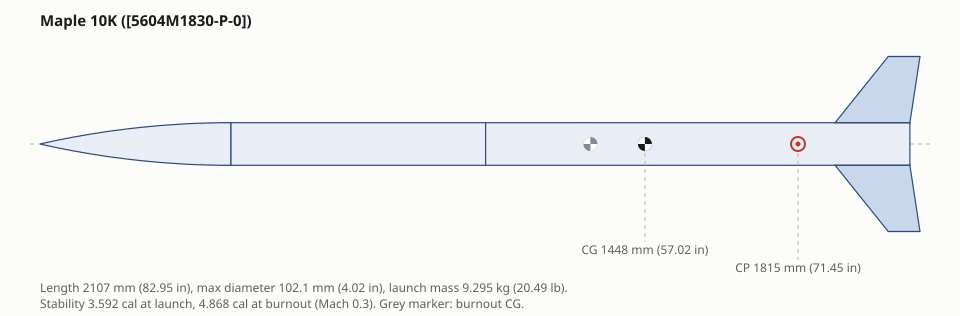
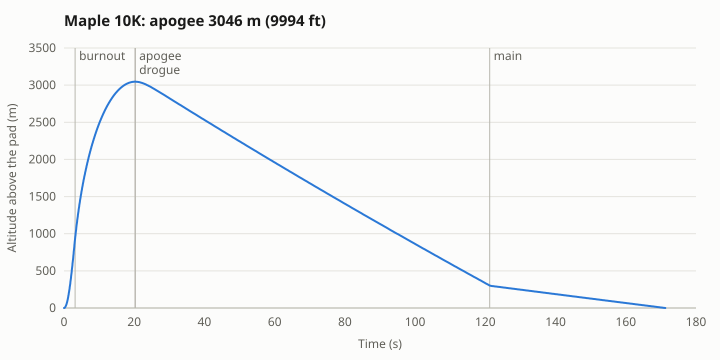
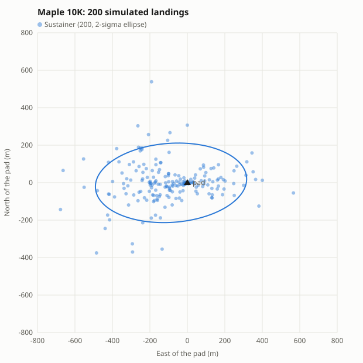
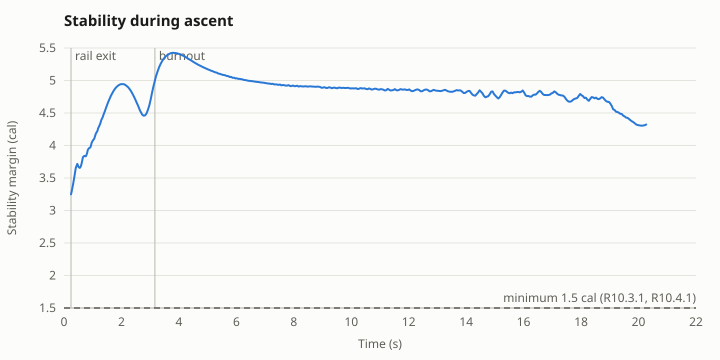

# Examples: what you ask, what you get

One rocket, from a blank page to launch day. Each step shows what a team member types, what Claude answers, and the
numbers and plots behind the answer. **Everything below is real output from the server** (OpenRocket 24.12), generated
by [`scripts/make_examples.py`](../scripts/make_examples.py); the one-line answers are written from those numbers.
Units follow the team setting (here metric with imperial in brackets).

The rocket: *Maple 10K*, a 4 in fiberglass, dual-deploy, single-stage rocket for the 10,000 ft category of Launch
Canada 2027.

## Design

### 1. "Design a 4 inch fiberglass rocket with a 75 mm motor mount, dual deploy: 18 in drogue at apogee, 60 in main at 1000 ft. 18 in ogive nose, 64 in of airframe, four trapezoidal fins."

Tools Claude uses: `open_design`, `add_component`, `set_deployment`

Claude builds the rocket part by part in OpenRocket (it opens in the OpenRocket app too) and saves it when asked.

### 2. "Which motor gets us closest to 10,000 ft?"

Tools Claude uses: `rank_motors`, `set_motor`

> **AeroTech L1170FJ**, 9,891 ft predicted. 68 distinct motors fit (diameter, length + 50 mm (1.969 in) overhang, filters); 60 simulated; 56 meet the rules: each one was flown in the simulation, not just looked up, and motors that break a rule (rail exit speed, thrust-to-weight, stability) are ranked last.

| Motor | Impulse | Apogee (vs 10,000 ft) | Rail exit | Max Mach | Min stability | Meets rules |
|---|---|---|---|---|---|---|
| AeroTech L1170FJ | L, 4214 Ns (947.4 lbf-s) | 3015 m (9891 ft) (-33.08 m (-108.5 ft)) | 40.14 m/s (131.7 ft/s) | 1.179 | 2.537 cal | yes |
| AeroTech L1250DM | L, 4400 Ns (989.2 lbf-s) | 3109 m (10200 ft) (+60.93 m (199.9 ft)) | 39.46 m/s (129.5 ft/s) | 1.139 | 2.675 cal | yes |
| Cesaroni Technology 3757L800-P | L, 3723 Ns (836.9 lbf-s) | 2970 m (9744 ft) (-78.02 m (-256 ft)) | 38.19 m/s (125.3 ft/s) | 1.038 | 2.726 cal | yes |
| AeroTech L1390G | L, 3946 Ns (887.2 lbf-s) | 2955 m (9695 ft) (-92.82 m (-304.5 ft)) | 44.49 m/s (146 ft/s) | 1.232 | 2.734 cal | yes |
| AeroTech L1940X | L, 4317 Ns (970.5 lbf-s) | 3197 m (10490 ft) (+149.4 m (490 ft)) | 55.13 m/s (180.9 ft/s) | 1.417 | 2.877 cal | yes |
| Cesaroni Technology 4263L1350-P | L, 4280 Ns (962.2 lbf-s) | 3208 m (10524 ft) (+159.6 m (523.8 ft)) | 45.27 m/s (148.5 ft/s) | 1.35 | 2.776 cal | yes |

### 3. "It goes supersonic. Will our 1/8 in fins flutter?"

Tools Claude uses: `fin_flutter`

> **FAIL.** At 398 m/s (1306 ft/s) (Mach 1.178) and 664.8 m the estimated flutter speed is only 163.2 m/s: margin 0.4099 against the team's required 1.5. Fins at least **7.599 mm (0.2992 in)** thick, a stiffer material or a lower aspect ratio fix it.

### 4. "We'll make the fins from 1/4 in quasi-isotropic carbon. Our coupon test gave a shear modulus of 16 GPa: save that to our standards and check again."

Tools Claude uses: `update_standards`, `edit_components`, `fin_flutter`

> **PASS**, margin 2.882 (shear modulus 16 GPa from your standards file, so every later check and the whole team use the measured value).

### 5. "Now make the fins as small and light as possible while meeting the stability rules (also in 30 km/h wind) and staying clear of flutter, then pick the motor again."

Tools Claude uses: `optimize`, `rank_motors`, `fin_flutter`

> Fin span **158.5 mm**, root chord **179 mm** (meets every constraint): stability 2.04 cal to 5.251 cal in flight, flutter margin 2.435. The lighter rocket now flies best on the **Cesaroni Technology 5604M1830-P**: 9,994 ft, Mach 1.424. Final flutter check: **PASS**, margin 1.838.

Limits used: minStability 2.04 cal = max(1.5 cal, 10% of body length at L:D 20.4); maxStability 6 cal (over-stable); flutter margin ≥ 1.5 from the team standards.

### 6. "Show me the rocket."

Tools Claude uses: `draw_rocket`

82.95 in long, 9.295 kg (20.49 lb) on the pad, stability 3.592 cal at launch and 4.868 cal at burnout.

## Recovery

### 7. "What main do we need to land at 20 ft/s? And a drogue for about 85 ft/s."

Tools Claude uses: `size_parachute`, `edit_components`

> The descending mass is 6.629 kg (14.62 lb), so the main needs a drag area of 2.856 m2 (30.75 ft2) (a 2132 mm flat canopy at Cd 0.8). Parachutes from OpenRocket's catalogue that do it:

| Parachute | Diameter | Cd | Descent | Packed size | Mass |
|---|---|---|---|---|---|
| Fruity Chutes CFC-060-N | 1524 mm (60 in) | 1.55 | 6.127 m/s (20.1 ft/s) | 101.6 mm (4 in) dia x 134.6 mm (5.3 in) = 1091 cm3 (66.6 in3) | 283.5 g (10 oz) |
| Rocketman EL-060 | 1524 mm (60 in) | 1.6 | 6.031 m/s (19.79 ft/s) | 101.6 mm (4 in) dia x 101.9 mm (4.01 in) = 825.8 cm3 (50.39 in3) | 280.7 g (9.9 oz) |
| Front Range Rocket Recovery FR3-16-60 | 1524 mm (60 in) | 1.5 | 6.228 m/s (20.43 ft/s) | 60.96 mm (2.4 in) dia x 154.9 mm (6.1 in) = 452.2 cm3 (27.6 in3) | 130.1 g (4.59 oz) |
| Rocketman DG-07 | 2134 mm (84 in) | 0.85 | 5.91 m/s (19.39 ft/s) | 101.6 mm (4 in) dia x 185.4 mm (7.3 in) = 1503 cm3 (91.73 in3) | 442.8 g (15.62 oz) |

*"Use the Fruity Chutes CFC-060-N and a 20 in drogue."*

### 8. "What loads do the chutes see when they open, and how many 4-40 nylon shear pins do we need?"

Tools Claude uses: `recovery_analysis`, `ejection_charge`

| device | opens at | design load | harness rating | descent |
|---|---|---|---|---|
| Drogue | 3046 m, 18.97 m/s | 65.04 N (14.62 lbf) | 130.1 N | 26.76 m/s (87.8 ft/s) |
| Main | 303.1 m, 25.99 m/s | 1591 N (357.6 lbf) | 3181 N | 5.973 m/s (19.6 ft/s) |

> Shear pins on the main bay: **3 x 4-40 nylon** (they must hold while the drogue opens). Black powder for a 4 × 12 in bay at 15 psi: **1.75 g** primary, 2.187 g backup. The harness rating is twice the opening load, for shock cord, quick links and eye bolts.

## Flight and rules

### 9. "Does it pass Launch Canada?"

Tools Claude uses: `check_requirements`

> **No failures; 4 warning(s).** Every check cites its rule, and there is a checklist of 15 things to verify by hand (electronics, radio, structures, operations).

|  | Check | Value | Rule |
|---|---|---|---|
| WARN | Launch site altitude | 0 m (0 ft) used by this simulation |  |
| WARN | Ascent stability (maximum, over-stability) | 5.425 cal | R10.3.1, R10.4.1 |
| WARN | Ascent stability in 8.333 m/s (27.34 ft/s) wind (maximum, over-stability) | 5.425 cal | R10.3.1, R10.4.1 |
| WARN | Maximum Mach number | 1.424 |  |
| PASS | Simulated launch angle | 6 deg | R10.1.1 |
| PASS | Rail departure velocity | 49.24 m/s (161.6 ft/s) | R10.2.1 |
| PASS | Thrust-to-weight at liftoff (avg thrust / liftoff weight) | 20.01 | R10.2.2, R3.1.2, R3.1.3; 2027 Edicts (Advanced Specific) |
| PASS | Ascent stability (minimum, rail exit to apogee while airspeed > 100 ft/s) | 3.25 cal at t=0.245 s, Mach 0.1455 | R10.3.1, R10.4.1 |
| PASS | Ascent stability in 8.333 m/s (27.34 ft/s) wind (minimum, rail exit to apogee while airspeed > 100 ft/s) | 2.301 cal at t=0.245 s, Mach 0.1501; angle of attack 10.73 deg there (wind / rail exit): OpenRocket's CP moves forward at high angle of attack. Zero-AoA margin: 3.65 cal | R10.3.1, R10.4.1 |
| PASS | Fin flutter margin (Fins, Carbon fiber) | 1.838 at 753.3 m (2471 ft), 480.1 m/s (1575 ft/s) | structures.flutterMinMargin |
| PASS | Length-to-diameter ratio | 20.63 | 2027 Edicts, Stability: L:D Ratio |
| PASS | Damping ratio during ascent (airspeed > 100 ft/s) | 0.06328 (t=17.82 s, Mach 0.09348) to 0.07583 (t=0.245 s) | 2027 Edicts, Stability: Damping ratio |

### 10. "Simulate the flight and plot it."

Tools Claude uses: `run_simulation`

> Apogee **3046 m (9994 ft)** at 20.27 s. Top speed 480 m/s (1575 ft/s) (Mach 1.424), 24.27 G peak, 49.24 m/s (161.6 ft/s) off the rail.

### 11. "Where will it land in a 15 km/h west wind? Include our build and motor uncertainty."

Tools Claude uses: `monte_carlo`

> Over 200 simulated flights the median landing is 174.8 m (573.5 ft) from the pad and 95% land within 460.3 m (1510 ft); the landings centre 286 ft west of the pad (the rail is tilted into the wind, so it flies upwind and drifts back under the drogue). Apogee 3041 m (9976 ft) ± 219.1 m (719 ft).

Claude also reports what drives the spread (correlation of each uncertain input with the result), so the team knows what to measure more carefully:

| Uncertain input | Apogee | Min stability | Landing distance |
|---|---|---|---|
| windSpeed | -0.08104 | -0.9575 | -0.4553 |
| launchAngle | -0.1296 | -0.003078 | 0.1627 |
| structureMass | -0.05058 | 0.1778 | 0.09537 |
| airframeDrag | -0.935 | 0.04173 | -0.1729 |
| motorThrust | 0.3212 | 0.04286 | 0.00564 |
| parachuteCd | -0.03292 | 0.0299 | -0.001973 |

Correlation from -1 to 1: the closer to ±1, the more that input drives the result.

## Design studies

### 12. "Would a different nose cone or fin shape fly higher?"

Tools Claude uses: `compare_shapes`

> Best that keeps the stability: **tangent ogive (current) nose with airfoil fin edges: 3661 m (12012 ft) (+20.19% vs current)**. Every nose profile and fin edge was flown; CD at the design Mach (1.424) shows where the gain comes from.

| Nose | Fin edges | Apogee | vs current | CD | Min stability |
|---|---|---|---|---|---|
| tangent ogive (current) | airfoil | 3661 m (12012 ft) | 20.19% | 0.7575 | 3.344 cal |
| tangent ogive (current) | rounded | 3516 m (11534 ft) | 15.41% | 0.8007 | 3.256 cal |
| tangent ogive (current) | square (current) | 3046 m (9994 ft) | 0% | 0.9307 | 3.25 cal |
| 1/2 power | square (current) | 3028 m (9936 ft) | -0.5832% | 0.9756 | 3.268 cal |
| Von Karman (Haack LD) | square (current) | 3028 m (9934 ft) | -0.6005% | 0.9821 | 3.255 cal |
| 1/2 parabola | square (current) | 3018 m (9903 ft) | -0.9156% | 0.9761 | 3.236 cal |
| 3/4 power | square (current) | 3018 m (9901 ft) | -0.9326% | 0.9791 | 3.245 cal |
| LV-Haack | square (current) | 3012 m (9881 ft) | -1.128% | 0.998 | 3.261 cal |

Claude's shape guidance (from the tool)

- Subsonic (< Mach 0.8): skin friction dominates; nose shape changes apogee by ~1-3%. Tangent ogive or elliptical are easy to make and near-optimal; a smooth finish and filled fin joints matter more.
- Transonic / supersonic: theory favours Von Karman / LV-Haack and a longer nose (5-6 calibers) for wave drag, and blunt shapes (elliptical, 1/2 power) lose. OpenRocket uses empirical per-shape curves, so at modest fineness a tangent ogive can rank equal or better in this table: trust the table for this vehicle, and the theory only as a tie-breaker.
- Fin edges: airfoiled or beveled edges reduce fin pressure drag, most at high speed; they also lower the fin's thickness where it is thin, so re-check fin_flutter. Swept, clipped-delta planforms suit supersonic flight.
- OpenRocket's nose and fin pressure-drag models are empirical and least accurate transonic; confirm close calls with RASAero (import_aero_table) or CFD before committing tooling.

## Reviews

### 13. "Make the design review package."

Tools Claude uses: `generate_report`

Claude writes a folder with `report.md` (requirement checks, vehicle, flight, stability, recovery, wind table, methods), the stability-vs-time plots Launch Canada asks for (DTEG R10.3.2), the drawing, the flight profile and a CSV of the flight data.

### 14. "What changed since the version we showed at PDR?"

Tools Claude uses: `compare_designs`

- launch mass: 9.305 kg (20.51 lb) -> 9.298 kg (20.5 lb) (-7.193 g (0.2537 oz) (-0.0773%))
- static stability at launch: 2.988 cal -> 3.593 cal (+0.6042 cal)
- apogee: 3015 m (9891 ft) -> 3046 m (9994 ft) (+31.3 m (102.7 ft) (+1.038%))
- max Mach: 1.179 -> 1.424 (+0.2453)
- rail exit velocity: 40.14 m/s (131.7 ft/s) -> 49.24 m/s (161.6 ft/s) (+9.101 m/s (29.86 ft/s) (+22.67%))
- min stability in flight: 2.537 cal -> 3.25 cal (+0.7129 cal)
- 7 rule check(s) changed status, 2 got worse
- 3 component(s) added, removed or edited

- **Main (Parachute)**: cD 0.8 -> 1.55
- **Fins (Trapezoidal Fin Set)**: height 127 mm (5 in) -> 158.5 mm (6.24 in); material Fiberglass -> Carbon fiber; rootChord 228.6 mm (9 in) -> 179 mm (7.048 in); sweepAngle 45 deg -> 38.7 deg; thickness 3.2 mm (0.126 in) -> 6.35 mm (0.25 in)
- **Drogue (Parachute)**: area 0.1642 m2 (1.767 ft2) -> 0.2027 m2 (2.182 ft2); diameter 457.2 mm (18 in) -> 508 mm (20 in)

## Launch day

### 15. "We launch at 48.47, -81.33 on August 21 at 3 pm. What will the winds do, and make us the flight card."

Tools Claude uses: `weather_forecast`, `flight_card`

> Ground wind 6.75 m/s (22.15 ft/s) (24.3 km/h) from 250 deg, gusts 12 m/s (39.37 ft/s) (43.2 km/h) (mean wind within 30 km/h limit; gusts exceed it). Flown in the forecast winds aloft: apogee 3106 m (10189 ft), landing 212.5 m (697.2 ft) from the pad.

(A recorded forecast is used here so the page is reproducible; with internet access Claude fetches the live one from Open-Meteo.)

Winds aloft from the forecast, flown as a wind profile:

- 10 m (32.81 ft) AGL: 6.75 m/s (22.15 ft/s) from 250 deg
- 180 m (590.6 ft) AGL: 9.79 m/s (32.12 ft/s) from 255 deg
- 690 m (2264 ft) AGL: 5.65 m/s (18.54 ft/s) from 262.5 deg
- 2710 m (8891 ft) AGL: 9.02 m/s (29.59 ft/s) from 267.5 deg
- 6880 m (22572 ft) AGL: 15.97 m/s (52.4 ft/s) from 278 deg
- 11480 m (37664 ft) AGL: 23.63 m/s (77.53 ft/s) from 289.5 deg

From the one-page flight card (predictions, motor delay, deployment settings, drift in each wind, rule check and sign-off lines):

> **Predicted flight**
>
> | | |
> |---|---|
> | Apogee | 3106 m (10189 ft) |
> | Time to apogee | 20.45 s |
> | Max velocity | 487.3 m/s (1599 ft/s) |
> | Max Mach | 1.424 |
> | Max acceleration | 238 m/s2 (780.7 ft/s2) = 24.26 G |
> | Rail exit velocity | 49.23 m/s (161.5 ft/s) |
> | Thrust-to-weight | 21.12 |

## After the flight

*"Here is our altimeter file — how did we do compared with the prediction?"* Claude lines the log up with the simulation (`compare_flight`), fits the drag so the next prediction is closer, and plots simulated against measured altitude.
