# Examples: what you ask, what you get

One rocket, from a blank page to launch day. Each step shows what a team member types, what Claude answers, and the
numbers and plots behind the answer. **Everything below is real output from the server** (OpenRocket 24.12), generated
by [`scripts/make_examples.py`](../scripts/make_examples.py); the one-line answers are written from those numbers.
Units follow the team setting (here metric with imperial in brackets). In Claude Desktop the plots and drawings
appear right in the chat, and long runs (optimizers, Monte Carlo) show their progress and can be stopped.

**Steps:** [Design](#design) · [Recovery](#recovery) · [Flight and rules](#flight-and-rules) ·
[Design studies](#design-studies) · [Structures and CFD](#structures-and-cfd) · [Build](#build) · [Reviews](#reviews) ·
[Launch day](#launch-day) · [Show it off](#show-it-off) · [After the flight](#after-the-flight) ·
[Team history](#team-history)

The rocket: *Maple 10K*, a 4 in fiberglass, dual-deploy, single-stage rocket for the 10,000 ft category of Launch
Canada 2027. Try it yourself: open [`examples/maple-10k-pdr.ork`](examples/maple-10k-pdr.ork) (the early version, before
step 3) or [`examples/maple-10k.ork`](examples/maple-10k.ork) (the finished design) and ask the same questions.

## Design

### 1. "Design a 4 inch fiberglass rocket with a 75 mm motor mount, dual deploy: 18 in drogue at apogee, 60 in main at 1000 ft. 18 in ogive nose, 64 in of airframe, four trapezoidal fins."

<sub>Tools Claude uses: `open_design`, `add_component`, `set_deployment`</sub>

Claude builds the rocket part by part in OpenRocket, inside as well as out: nose bulkhead, motor mount with three centering rings, rail buttons, both parachutes (with realistic packed sizes) and their shock cords. It opens in the OpenRocket app too.

### 2. "Lay out the avionics bay between the two airframes: two independent altimeters, a GPS tracker, and the ejection charges."

<sub>Tools Claude uses: `add_avionics_bay`</sub>

> Av-bay: 25.4 mm (1 in) switch band, 304.8 mm (12 in) coupler between Upper airframe and Lower airframe: 2 independent altimeter circuits (each: altimeter + own battery + own physical switch), GPS tracker on its own battery in the nose; main primary + backup on the forward bulkhead, drogue primary + backup on the aft bulkhead. Bay mass 567.6 g (1.251 lb). Static ports: bay volume 135 in3: 4 ports of 0.145 in (3.7 mm) evenly around the switch band (same area as 1 x 1/4 in).

<details><summary>Bay layout</summary>

| Part | Position | Mass |
|---|---|---|
| Main charge (primary) | 901.7 mm from the nose tip | 12 g |
| Main charge (backup) | 901.7 mm from the nose tip | 12 g |
| U-bolt (main harness) | 906.8 mm from the nose tip | 30 g |
| Sled, threaded rods and nuts | 939.3 mm from the nose tip | 120 g |
| 9 V battery (primary altimeter) | 943.5 mm from the nose tip | 46 g |
| Primary altimeter | 995.1 mm from the nose tip | 25 g |
| Screw switch (primary altimeter) | 1067 mm from the nose tip | 10 g |
| Screw switch (backup altimeter) | 1067 mm from the nose tip | 10 g |
| Backup altimeter | 1079 mm from the nose tip | 25 g |
| 9 V battery (backup altimeter) | 1168 mm from the nose tip | 46 g |
| Drogue charge (primary) | 1232 mm from the nose tip | 12 g |
| Drogue charge (backup) | 1232 mm from the nose tip | 12 g |
| U-bolt (drogue harness) | 1232 mm from the nose tip | 30 g |

</details>

> ⚠️ not enough room in Upper airframe: the charges, shock cord and parachute need 520.1 mm (20.48 in) from the av-bay but only 508 mm (20 in) is free before the nose shoulder. Lengthen the airframe, shorten the coupler, or use a smaller-packing parachute.

> ⚠️ not enough room in Lower airframe: the charges, shock cord and parachute need 298 mm (11.73 in) from the av-bay but only 254 mm (10 in) is free before the motor mount. Lengthen the airframe, shorten the coupler, or use a smaller-packing parachute.

*"Lengthen the upper airframe to 26 in and the lower airframe to 43 in."* The bay packs the parachutes against itself and the motor mount, fins and rail buttons are positioned from the aft end, so everything keeps its place and the parachutes get the room.

The layout follows the Launch Canada electronics edicts: one altimeter per circuit, each with its own battery and physical switch; the tracker on its own battery; charges on the bulkhead facing the bay they open. Masses are typical defaults: give Claude your actual altimeters, batteries and tracker (name, mass, length) and it uses them.

### 3. "Which motor gets us closest to 10,000 ft?"

<sub>Tools Claude uses: `rank_motors`, `set_motor`</sub>

> **AeroTech L1250DM**, 10,116 ft predicted. 68 distinct motors fit (diameter, length + 50 mm (1.969 in) overhang, filters); 60 simulated; 57 meet the rules: each one was flown in the simulation, not just looked up, and motors that break a rule (rail exit speed, thrust-to-weight, stability) are ranked last.

| Motor | Impulse | Apogee (vs 10,000 ft) | Rail exit | Max Mach | Min stability | Meets rules |
|---|---|---|---|---|---|---|
| AeroTech L1250DM | L, 4400 Ns (989.2 lbf-s) | 3083 m (10116 ft) (+35.46 m (116.3 ft)) | 39.48 m/s (129.5 ft/s) | 1.165 | 1.921 cal | yes |
| AeroTech L1170FJ | L, 4214 Ns (947.4 lbf-s) | 2985 m (9792 ft) (-63.36 m (-207.9 ft)) | 40.26 m/s (132.1 ft/s) | 1.208 | 1.743 cal | yes |
| AeroTech L1940X | L, 4317 Ns (970.5 lbf-s) | 3157 m (10359 ft) (+109.4 m (358.8 ft)) | 54.77 m/s (179.7 ft/s) | 1.46 | 2.044 cal | yes |
| Cesaroni Technology 3757L800-P | L, 3723 Ns (836.9 lbf-s) | 2937 m (9636 ft) (-110.8 m (-363.6 ft)) | 38.61 m/s (126.7 ft/s) | 1.054 | 1.848 cal | yes |
| Cesaroni Technology 4263L1350-P | L, 4280 Ns (962.2 lbf-s) | 3167 m (10390 ft) (+118.8 m (389.9 ft)) | 45.42 m/s (149 ft/s) | 1.386 | 1.911 cal | yes |
| AeroTech L1390G | L, 3946 Ns (887.2 lbf-s) | 2925 m (9598 ft) (-122.5 m (-401.9 ft)) | 44.64 m/s (146.4 ft/s) | 1.266 | 1.889 cal | yes |

### 4. "It goes supersonic. Will our 1/8 in fins flutter?"

<sub>Tools Claude uses: `fin_flutter`</sub>

> **FAIL.** At 393.4 m/s (1291 ft/s) (Mach 1.165) and 661.7 m the estimated flutter speed is only 163.1 m/s: margin 0.4147 against the team's required 1.5. Fins at least **7.54 mm (0.2969 in)** thick, a stiffer material or a lower aspect ratio fix it.

### 5. "We'll make the fins from 1/4 in quasi-isotropic carbon. Our coupon test gave a shear modulus of 16 GPa: save that to our standards and check again."

<sub>Tools Claude uses: `update_standards`, `edit_components`, `fin_flutter`</sub>

> **PASS**, margin 2.905 (shear modulus 16 GPa from your standards file, so every later check and the whole team use the measured value).

### 6. "It has to meet the stability rules (also in 30 km/h wind): add the nose weight it needs, then optimize the fin shape for the least drag while staying clear of flutter (span no more than 8 in), and pick the motor again."

<sub>Tools Claude uses: `ballast`, `add_component`, `optimize_fins`, `rank_motors`, `fin_flutter`</sub>

> **390 g of nose ballast**, then the whole fin shape at once: root chord **135.5 mm**, tip chord **99.5 mm**, span **178.6 mm**, sweep **28.52 mm** (meets every constraint; launch mass +73.82 g (2.604 oz)): stability 2.233 cal to 5.139 cal in flight, flutter margin 2.791. Best motor now: **AeroTech M1315W**, 9,795 ft, Mach 1.182. Final flutter check: **PASS**, margin 2.376.

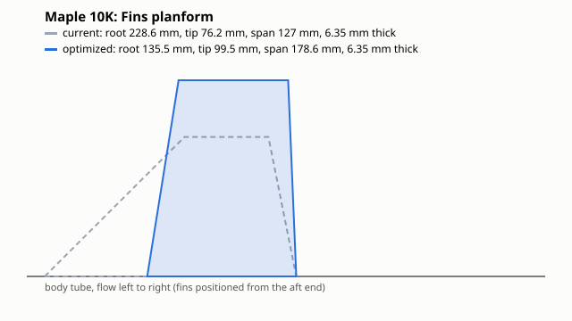

<sub>Only buildable fins are tried: tip chord at least 0.5 in, no tip trailing edge behind the root (it would take the landing), leading-edge sweep at most 65 deg, span at most 8 in as asked. Why ballast: with the real avionics bay modelled, the electronics sit further aft than a single lump would, so the CG moves back. Limits used: minStability 2.189 cal = max(1.5 cal, 10% of body length at L:D 21.89); maxStability 6 cal (over-stable); flutter margin ≥ 1.5 from the team standards.</sub>

### 7. "Show me the rocket."

<sub>Tools Claude uses: `draw_rocket`</sub>

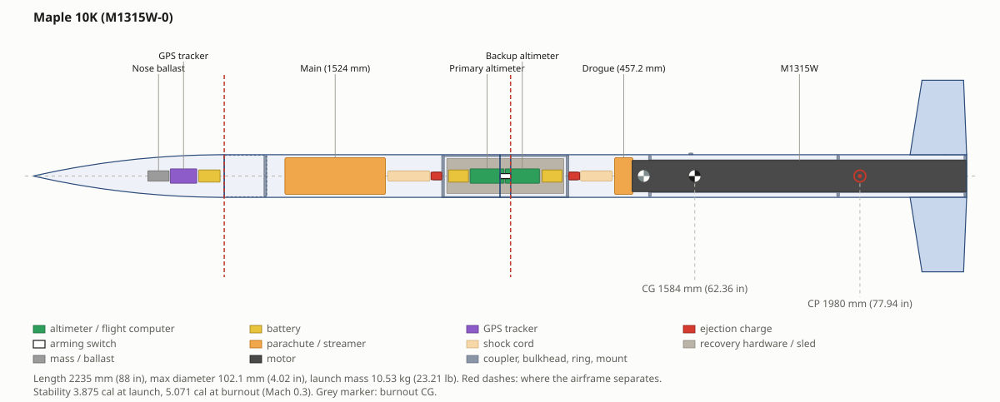

A cut-away from the OpenRocket model itself: every part is drawn where it is, electronics coloured by role, and the red dashes show where the rocket separates (main at the nose, drogue below the avionics bay).

88 in long, 10.53 kg (23.21 lb) on the pad, stability 3.875 cal at launch and 5.071 cal at burnout.

### 8. "What if we used 1/8 in carbon for the fins to save weight?"

<sub>Tools Claude uses: `edit_components`, `fin_flutter`</sub>

> Claude makes the change and checks it: flutter **FAIL**, margin 0.7306 (flutter speed / airspeed; the team wants 1.5). Thinner fins would need 5.129 mm to be safe.

### 9. "Undo that."

<sub>Tools Claude uses: `undo`, `history`</sub>

> Undone: *edit_components* (the thickness change). Every edit in the session can be undone or redone, newest first; `history` lists them (21 so far in this session). Nothing touches the `.ork` file until you ask Claude to save.

## Recovery

### 10. "What main do we need to land at 20 ft/s? And a drogue for about 85 ft/s."

<sub>Tools Claude uses: `size_parachute`, `edit_components`</sub>

> The descending mass is 7.08 kg (15.61 lb), so the main needs a drag area of 3.051 m2 (32.84 ft2) (a 2203 mm flat canopy at Cd 0.8). Parachutes from OpenRocket's catalogue that do it:

| Parachute | Diameter | Cd | Descent | Packed size | Mass |
|---|---|---|---|---|---|
| Rocketman DG-07 | 2134 mm (84 in) | 0.85 | 6.108 m/s (20.04 ft/s) | 101.6 mm (4 in) dia x 185.4 mm (7.3 in) = 1503 cm3 (91.73 in3) | 442.8 g (15.62 oz) |
| Rocketman LA-07 | 2134 mm (84 in) | 0.85 | 6.108 m/s (20.04 ft/s) | 76.2 mm (3 in) dia x 188 mm (7.4 in) = 857.2 cm3 (52.31 in3) | 252.3 g (8.9 oz) |
| Rocketman EL-060 | 1524 mm (60 in) | 1.6 | 6.232 m/s (20.45 ft/s) | 101.6 mm (4 in) dia x 101.9 mm (4.01 in) = 825.8 cm3 (50.39 in3) | 280.7 g (9.9 oz) |
| Fruity Chutes CFC-060-N | 1524 mm (60 in) | 1.55 | 6.332 m/s (20.77 ft/s) | 101.6 mm (4 in) dia x 134.6 mm (5.3 in) = 1091 cm3 (66.6 in3) | 283.5 g (10 oz) |

*"Use the Rocketman DG-07 and a 21 in drogue."*

### 11. "What loads do the chutes see when they open, and how many 4-40 nylon shear pins do we need?"

<sub>Tools Claude uses: `recovery_analysis`, `ejection_charge`</sub>

| device | opens at | design load | harness rating | descent |
|---|---|---|---|---|
| Drogue | 2988 m, 19.73 m/s | 70.62 N (15.88 lbf) | 141.2 N | 26.53 m/s (87.03 ft/s) |
| Main | 296.7 m, 25.78 m/s | 1684 N (378.5 lbf) | 3367 N | 5.999 m/s (19.68 ft/s) |

> Shear pins on the main bay: **3 x 4-40 nylon** (they must hold while the drogue opens). Black powder for a 4 × 12 in bay at 15 psi: **1.75 g** primary, 2.187 g backup. The harness rating is twice the opening load, for shock cord, quick links and eye bolts.

## Flight and rules

### 12. "Does it pass Launch Canada?"

<sub>Tools Claude uses: `check_requirements`</sub>

> **No failures; 4 warning(s).** Every check cites its rule, and there is a checklist of 15 things to verify by hand (electronics, radio, structures, operations).

|  | Check | Value | Rule |
|---|---|---|---|
| WARN | Launch site altitude | 0 m (0 ft) used by this simulation |  |
| WARN | Ascent stability (maximum, over-stability) | 5.693 cal | R10.3.1, R10.4.1 |
| WARN | Ascent stability in 8.333 m/s (27.34 ft/s) wind (maximum, over-stability) | 5.689 cal | R10.3.1, R10.4.1 |
| WARN | Maximum Mach number | 1.175 |  |
| PASS | Simulated launch angle | 6 deg | R10.1.1 |
| PASS | Rail departure velocity | 41.63 m/s (136.6 ft/s) | R10.2.1 |
| PASS | Thrust-to-weight at liftoff (avg thrust / liftoff weight) | 11.03 | R10.2.2, R3.1.2, R3.1.3; 2027 Edicts (Advanced Specific) |
| PASS | Ascent stability (minimum, rail exit to apogee while airspeed > 100 ft/s) | 3.522 cal at t=0.335 s, Mach 0.1232; angle of attack 3.113 deg there (wind / rail exit): OpenRocket's CP moves forward at high angle of attack. Zero-AoA margin: 4.002 cal | R10.3.1, R10.4.1 |
| PASS | Ascent stability in 8.333 m/s (27.34 ft/s) wind (minimum, rail exit to apogee while airspeed > 100 ft/s) | 2.424 cal at t=0.335 s, Mach 0.128; angle of attack 12.3 deg there (wind / rail exit): OpenRocket's CP moves forward at high angle of attack. Zero-AoA margin: 4.003 cal | R10.3.1, R10.4.1 |
| PASS | Fin flutter margin (Fins, Carbon fiber) | 2.388 at 942.1 m (3091 ft), 395.2 m/s (1297 ft/s) | structures.flutterMinMargin |
| PASS | Length-to-diameter ratio | 21.89 | 2027 Edicts, Stability: L:D Ratio |
| PASS | Damping ratio during ascent (airspeed > 100 ft/s) | 0.06727 (t=17.95 s, Mach 0.09438) to 0.08034 (t=4.549 s) | 2027 Edicts, Stability: Damping ratio |

### 13. "Simulate the flight and plot it."

<sub>Tools Claude uses: `run_simulation`</sub>

> Apogee **2988 m (9803 ft)** at 20.4 s. Top speed 395.2 m/s (1297 ft/s) (Mach 1.175), 15.63 G peak, 41.63 m/s (136.6 ft/s) off the rail.

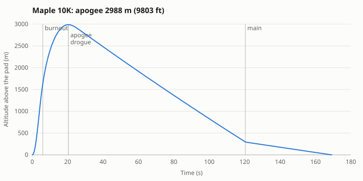

### 14. "Where will it land in a 15 km/h west wind? Include our build and motor uncertainty, and give us a map for Google Earth."

<sub>Tools Claude uses: `monte_carlo`</sub>

> Over 200 simulated flights the median landing is 201.2 m (660.1 ft) from the pad and 95% land within 489.3 m (1605 ft); the landings centre 494 ft west of the pad (the rail is tilted into the wind, so it flies upwind and drifts back under the drogue). Apogee 2973 m (9754 ft) ± 201.1 m (659.6 ft).

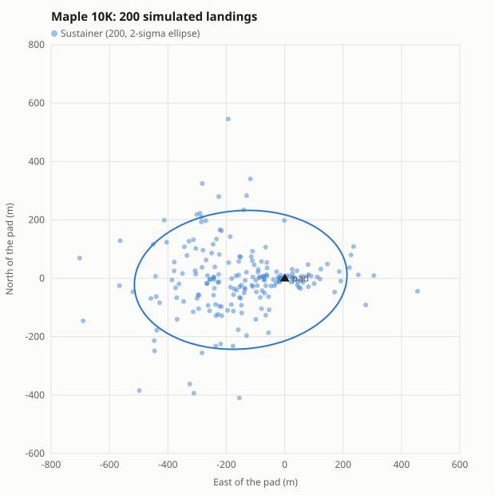

[`landing.kml`](examples/landing.kml) puts the pad, every landing and the ellipse on the map in Google Earth (desktop, web or phone), so the recovery team and the RSO see the fields, roads and trees it covers.

Claude also reports what drives the spread (correlation of each uncertain input with the result), so the team knows what to measure more carefully:

| Uncertain input | Apogee | Min stability | Landing distance |
|---|---|---|---|
| windSpeed | -0.1303 | -0.9653 | -0.6773 |
| launchAngle | -0.1489 | -0.006994 | 0.3163 |
| structureMass | -0.05115 | 0.1309 | 0.09484 |
| airframeDrag | -0.9259 | 0.04255 | -0.173 |
| motorThrust | 0.3178 | 0.08091 | -0.01958 |
| parachuteCd | -0.03381 | 0.03086 | -0.075 |

<sub>Correlation from -1 to 1: the closer to ±1, the more that input drives the result.</sub>

## Design studies

### 15. "Would a different nose cone or fin shape fly higher?"

<sub>Tools Claude uses: `compare_shapes`</sub>

> Best that keeps the stability: **tangent ogive (current) nose with airfoil fin edges: 3708 m (12165 ft) (+24.1% vs current)**. Every nose profile and fin edge was flown; CD at the design Mach (1.175) shows where the gain comes from.

| Nose | Fin edges | Apogee | vs current | CD | Min stability |
|---|---|---|---|---|---|
| tangent ogive (current) | airfoil | 3708 m (12165 ft) | 24.1% | 1.085 | 3.611 cal |
| Von Karman (Haack LD) | airfoil | 3705 m (12156 ft) | 24.01% | 1.075 | 3.614 cal |
| tangent ogive (current) | rounded | 3575 m (11730 ft) | 19.66% | 1.144 | 3.528 cal |
| Von Karman (Haack LD) | square (current) | 3002 m (9850 ft) | 0.4851% | 1.341 | 3.525 cal |
| 1/2 power | square (current) | 3001 m (9847 ft) | 0.4484% | 1.34 | 3.537 cal |
| LV-Haack | square (current) | 2993 m (9821 ft) | 0.189% | 1.356 | 3.533 cal |
| 3/4 power | square (current) | 2989 m (9805 ft) | 0.02348% | 1.36 | 3.513 cal |
| tangent ogive (current) | square (current) | 2988 m (9803 ft) | 0% | 1.351 | 3.522 cal |

<details><summary>Claude's shape guidance (from the tool)</summary>

- Subsonic (< Mach 0.8): skin friction dominates; nose shape changes apogee by ~1-3%. Tangent ogive or elliptical are easy to make and near-optimal; a smooth finish and filled fin joints matter more.
- Transonic / supersonic: theory favours Von Karman / LV-Haack and a longer nose (5-6 calibers) for wave drag, and blunt shapes (elliptical, 1/2 power) lose. OpenRocket uses empirical per-shape curves, so at modest fineness a tangent ogive can rank equal or better in this table: trust the table for this vehicle, and the theory only as a tie-breaker.
- Fin edges: airfoiled or beveled edges reduce fin pressure drag, most at high speed; they also lower the fin's thickness where it is thin, so re-check fin_flutter. Swept, clipped-delta planforms suit supersonic flight.
- OpenRocket's nose and fin pressure-drag models are empirical and least accurate transonic; confirm close calls with RASAero (import_aero_table) or CFD before committing tooling.

</details>

## Structures and CFD

### 16. "Check the fins in FEA: our quasi-isotropic laminate has E = 45 GPa and Poisson's ratio 0.3. And give us the joint loads for the airframe FEA."

<sub>Tools Claude uses: `fin_fea`, `structural_loads`</sub>

> **PASS**, margin of safety 8.957 with the team's safety factor of 2. Design load 210.7 N (47.38 lbf) (limit load; the most loaded fin), from the crosswind gust at max q at t=3.905 s, Mach 1.174, q 87.33 kPa (12.67 psi), angle of attack 1.208 deg. Tip deflection 1.085 mm; peak stress 22.6 MPa. Natural frequencies: 182.6 Hz (1st bending), 630.5 Hz (1st torsion), 1062 Hz (2nd bending).

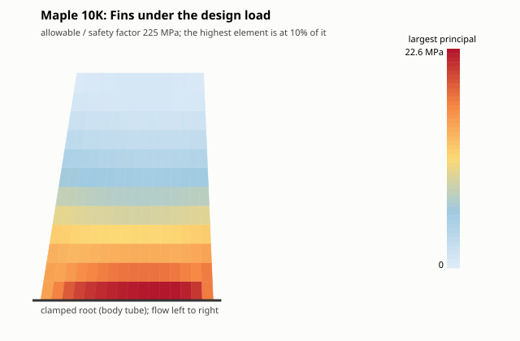

Claude writes a CalculiX model of the fin (8-node shells, clamped root, the flight load) and runs it when CalculiX is installed. The input deck is kept, so a team member can refine it in PrePoMax or Abaqus. The model was checked against cantilever plate theory: deflection, root stress and first frequency agree within 0.2%. The stress peaks at the root, most at its corners, where the real fin's fillet or tab spreads the load.

Joint loads for the airframe: 3 joints, the highest wall stress at Switch band / Lower airframe: 4378 kPa (635 psi); the load cases (axial force, bending moments, the flight time, Mach and angle of attack of each) go to a CSV for the tube and coupler FEA.

### 17. "Export it for CFD, and tell us which cases to run."

<sub>Tools Claude uses: `export_geometry`</sub>

> The rocket as STL (9840 triangles, mm, one region per part so the solver reports the force on each), the fin cutting pattern as DXF for the waterjet or laser, and a run matrix taken from the simulated flight: each Mach number at the altitude where the rocket reaches it. When the CFD results are in, `import_aero_table` reads them back and every later simulation and rule check uses them.

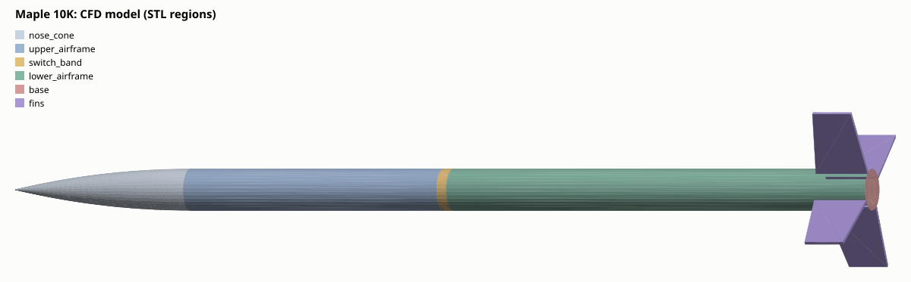

| Case | Mach | Altitude | Velocity | Reynolds | OpenRocket CD |
|---|---|---|---|---|---|
| M0.10 | 0.1 | 3.871 m (12.7 ft) | 34.04 m/s (111.7 ft/s) | 5.21e+06 | 1.061 |
| M0.30 | 0.3 | 34.89 m (114.5 ft) | 102.1 m/s (334.9 ft/s) | 1.56e+07 | 1.083 |
| M0.50 | 0.5 | 97.9 m (321.2 ft) | 170 m/s (557.7 ft/s) | 2.58e+07 | 1.128 |
| M0.70 | 0.7 | 197.3 m (647.1 ft) | 237.7 m/s (779.9 ft/s) | 3.58e+07 | 1.197 |
| M0.80 | 0.8 | 267.7 m (878.3 ft) | 271.5 m/s (890.6 ft/s) | 4.07e+07 | 1.24 |
| M0.90 | 0.9 | 352.3 m (1156 ft) | 305.1 m/s (1001 ft/s) | 4.54e+07 | 1.29 |
| M0.95 | 0.95 | 398.9 m (1309 ft) | 321.9 m/s (1056 ft/s) | 4.77e+07 | 1.311 |
| M1.00 | 1 | 459.8 m (1509 ft) | 338.6 m/s (1111 ft/s) | 5.00e+07 | 1.334 |
| M1.05 | 1.05 | 539.6 m (1770 ft) | 355.2 m/s (1165 ft/s) | 5.21e+07 | 1.38 |
| M1.10 | 1.1 | 654 m (2146 ft) | 371.6 m/s (1219 ft/s) | 5.40e+07 | 1.385 |
| M1.20 | 1.2 | 981.1 m (3219 ft) | 403.8 m/s (1325 ft/s) | 5.72e+07 | 1.334 |
| max_q | 1.174 | 942.1 m (3091 ft) | 395.2 m/s (1297 ft/s) | 5.61e+07 | 1.352 |

## Build

### 18. "We weighed the parts we've built. Here is our weigh-in sheet; how does it compare with the model? Our launch mass target is 12 kg."

<sub>Tools Claude uses: `mass_budget`</sub>

<details><summary>Weigh-in sheet (sample numbers)</summary>

```csv
part,mass (g),status,section,parent
Nose cone,491,measured,no,
Upper airframe,830,measured,no,
Lower airframe,1398,measured,no,
Fins,1091,measured,no,
Fin fillets and tip-to-tip epoxy,140,measured,no,Lower airframe
Paint and primer,90,estimated,no,Upper airframe
```

</details>

| Part | Weigh-in | Model | Difference |  |
|---|---|---|---|---|
| Fins | 1.091 kg (2.405 lb) (measured) | 948.9 g (2.092 lb) | +142.1 g (5.013 oz) (+15%) | CHECK |
| Lower airframe | 1.398 kg (3.082 lb) (measured) | 1.271 kg (2.802 lb) | +127.1 g (4.482 oz) (+10%) | ok |
| Upper airframe | 830 g (1.83 lb) (measured) | 768.5 g (1.694 lb) | +61.53 g (2.17 oz) (+8%) | ok |
| Nose cone | 491 g (1.082 lb) (measured) | 438.8 g (15.48 oz) | +52.17 g (1.84 oz) (+12%) | CHECK |
| Fin fillets and tip-to-tip epoxy | 140 g (4.938 oz) (measured) |  |  |  |
| Paint and primer | 90 g (3.175 oz) (estimated) |  |  |  |

> Projected launch mass **11.43 kg (25.2 lb)**, including 5.645 kg (12.44 lb) of motor and 10% contingency on everything not weighed yet: +569 g (1.254 lb) under the target of 12 kg. 2 part(s) differ from the model by more than 10% (flagged). The sheet leaves out 1.579 kg of parts the model has (heaviest: Nose ballast 390 g (13.76 oz), Main 242.8 g (8.564 oz), Motor mount 186.8 g (6.589 oz)), which stay at the model's values.

### 19. "Put the weigh-ins into the design."

<sub>Tools Claude uses: `mass_budget`</sub>

> Done: 6 changes (mass overrides on the weighed parts, the fillets and paint added as mass components). Launch mass 10.65 kg (23.48 lb) -> 11.26 kg (24.83 lb), CG 1574 mm (61.99 in) -> 1568 mm (61.74 in), stability 3.968 -> 4.03 cal. Every later step flies the rocket as built; `undo` takes it back in one step.

## Reviews

### 20. "Where do we stand? What's left before CDR?"

<sub>Tools Claude uses: `design_status`</sub>

> **In progress: 2 thing(s) to set up, 4 warning(s).** Launch Canada 2027: DTEG Revision 4 + LC 2027 DTEG and R&R Edicts (to become DTEG R5): No failures; 4 warning(s).

| Area | Status | Finding |
|---|---|---|
| Launch site | WARN | Launch site altitude: 0 m (0 ft) used by this simulation |
| Stability | WARN | Ascent stability (maximum, over-stability): 5.683 cal (R10.3.1, R10.4.1) |
| Stability | WARN | Ascent stability in 8.333 m/s (27.34 ft/s) wind (maximum, over-stability): 5.68 cal (R10.3.1, R10.4.1) |
| Rules | WARN | Maximum Mach number: 1.144 |
| Standards | TODO | The team standards were changed in this session but are not saved to a file, so the next session and the rest of the team will not have them. |
| File | TODO | Unsaved changes (22 edit(s) this session, undo available). |

Next steps, in order:

1. update_standards launchSite.altitudeMsl (and weather_forecast on the day).
2. optimize_fins (smaller fins) or less nose ballast.
3. check_requirements for the details and rule reference.
4. update_standards with saveTo (e.g. openrocket-mcp.json), then commit the file.
5. save_design once the team agrees (history shows what changed).

### 21. "Make the design review package."

<sub>Tools Claude uses: `generate_report`</sub>

Claude writes a folder with `report.md` (requirement checks, vehicle, flight, stability, recovery, wind table, methods), the stability-vs-time plots Launch Canada asks for (DTEG R10.3.2), the drawing, the flight profile and a CSV of the flight data.

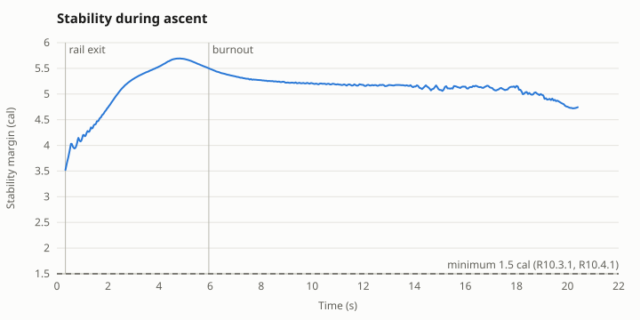

### 22. "What changed since the version we showed at PDR?"

<sub>Tools Claude uses: `compare_designs`</sub>

- launch mass: 9.652 kg (21.28 lb) -> 11.26 kg (24.83 lb) (+1.613 kg (3.555 lb) (+16.71%))
- static stability at launch: 2.508 cal -> 4.03 cal (+1.522 cal)
- apogee: 3083 m (10116 ft) -> 2998 m (9838 ft) (-84.99 m (278.8 ft) (-2.756%))
- max Mach: 1.165 -> 1.144 (-0.02131)
- rail exit velocity: 39.48 m/s (129.5 ft/s) -> 40.59 m/s (133.2 ft/s) (+1.108 m/s (3.635 ft/s) (+2.806%))
- min stability in flight: 1.921 cal -> 3.576 cal (+1.654 cal)
- 9 rule check(s) changed status, 2 got worse
- 9 component(s) added, removed or edited

- **Nose cone (Nose Cone)**: massOverridden false -> true; overrideMass 438.8 g (15.48 oz) -> 491 g (1.082 lb)
- **Upper airframe (Body Tube)**: massOverridden false -> true; overrideMass 768.5 g (1.694 lb) -> 830 g (1.83 lb)
- **Main (Parachute)**: area 1.824 m2 (19.63 ft2) -> 3.575 m2 (38.48 ft2); cD 0.8 -> 0.85; diameter 1524 mm (60 in) -> 2134 mm (84 in)
- **Lower airframe (Body Tube)**: massOverridden false -> true; overrideMass 1.271 kg (2.802 lb) -> 1.398 kg (3.082 lb)

## Launch day

### 23. "We launch at 48.47, -81.33 on August 21 at 3 pm. What will the winds do, and make us the flight card."

<sub>Tools Claude uses: `weather_forecast`, `flight_card`</sub>

> Ground wind 6.75 m/s (22.15 ft/s) (24.3 km/h) from 250 deg, gusts 12 m/s (39.37 ft/s) (43.2 km/h) (mean wind within 30 km/h limit; gusts exceed it). Flown in the forecast winds aloft: apogee 3023 m (9918 ft), landing 99.93 m (327.9 ft) from the pad.

<sub>(A recorded forecast is used here so the page is reproducible; with internet access Claude fetches the live one from Open-Meteo.)</sub>

Winds aloft from the forecast, flown as a wind profile:

- 10 m (32.81 ft) AGL: 6.75 m/s (22.15 ft/s) from 250 deg
- 180 m (590.6 ft) AGL: 9.79 m/s (32.12 ft/s) from 255 deg
- 690 m (2264 ft) AGL: 5.65 m/s (18.54 ft/s) from 262.5 deg
- 2710 m (8891 ft) AGL: 9.02 m/s (29.59 ft/s) from 267.5 deg
- 6880 m (22572 ft) AGL: 15.97 m/s (52.4 ft/s) from 278 deg
- 11480 m (37664 ft) AGL: 23.63 m/s (77.53 ft/s) from 289.5 deg

From the one-page flight card (predictions, motor delay, deployment settings, drift in each wind, rule check and sign-off lines):

> **Predicted flight**
>
> | | |
> |---|---|
> | Apogee | 3023 m (9918 ft) |
> | Time to apogee | 20.8 s |
> | Max velocity | 392.3 m/s (1287 ft/s) |
> | Max Mach | 1.15 |
> | Max acceleration | 144.9 m/s2 (475.5 ft/s2) = 14.78 G |
> | Rail exit velocity | 40.58 m/s (133.1 ft/s) |
> | Thrust-to-weight | 12.89 |

### 24. "Where should the rail buttons go to get the most out of the rail?"

<sub>Tools Claude uses: `rail_buttons`</sub>

> The aft button goes 15 mm above the aft end and the forward one 955.7 mm up, 940.7 mm apart. The rocket leaves the rail at 39.82 m/s instead of 39.69 m/s with today's layout. OpenRocket says 40.58 m/s because it counts the whole rail and ignores where the buttons are.

|  | Current | Recommended |
|---|---|---|
| Forward button | 660.4 mm (26 in) above the aft end (1575 mm (62 in) from the nose tip) (no backing: add a block) | 955.7 mm (37.63 in) above the aft end (1280 mm (50.38 in) from the nose tip) (over Av-bay coupler) |
| Aft button | 50.8 mm (2 in) above the aft end (2184 mm (86 in) from the nose tip) (no backing: add a block) | 15 mm (0.5906 in) above the aft end (2220 mm (87.41 in) from the nose tip) (no backing: add a block) |
| Rail exit | 39.69 m/s (130.2 ft/s) | 39.82 m/s (130.6 ft/s) |
| Tip-off | 1.68 deg/s pitch rate, 0.01327 deg, over 15.79 ms on the aft button alone | 2.74 deg/s pitch rate, 0.03379 deg, over 24.67 ms on the aft button alone |
| Pointing error at rail exit | 0.1073 deg (tip-off + slop) | 0.0947 deg (tip-off + slop) |
| Side loads | forward 24.11 N (5.42 lbf), aft 23.96 N (5.387 lbf) | forward 17.19 N (3.863 lbf), aft 29.85 N (6.711 lbf) |

- 'Centering ring 1' is 11.83 mm (0.4656 in) aft of the aft button: move it under the button, or glue a block there, so the screw bites into it.
- Put a backing block or ring under every button without one (glued inside the tube), or the screw only holds in the tube wall.

Say "move them" and Claude applies it to the design (`apply`); `undo` takes it back.

## Show it off

### 25. "Make an exploded view for our design review poster, with the parts list."

<sub>Tools Claude uses: `render_3d`</sub>

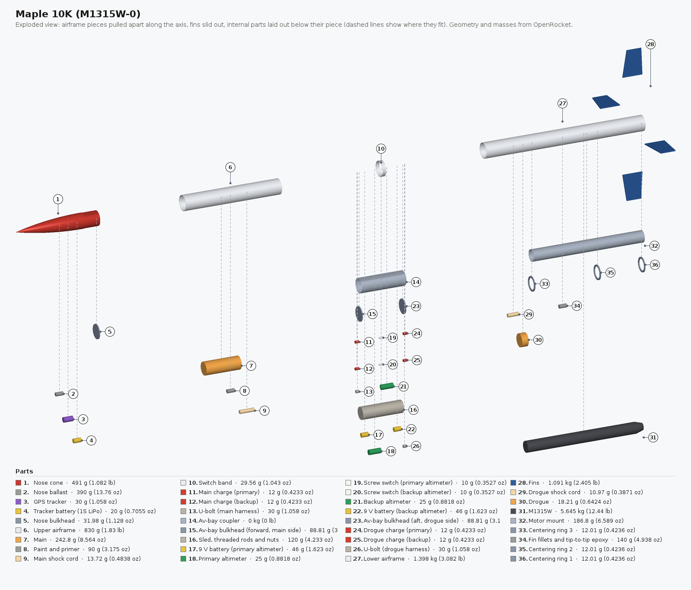

36 parts, each with OpenRocket's mass (the weighed values from the mass budget). The heaviest: M1315W (5.645 kg), Lower airframe (1.398 kg), Fins (1.091 kg). Ask for `cutaway` to see them in place instead.

### 26. "Animate the flight for our social media post."

<sub>Tools Claude uses: `animate_flight`</sub>

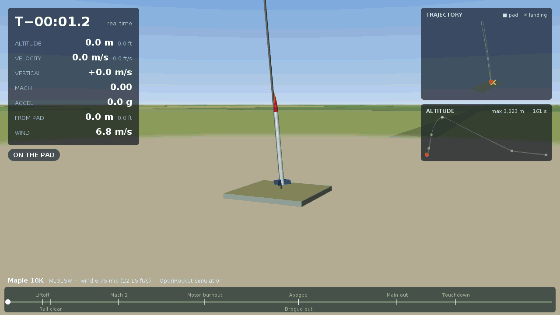

A 19.8 s loop (GIF; an MP4 too when ffmpeg is installed), and a sheet of stills that Claude shows in the chat:

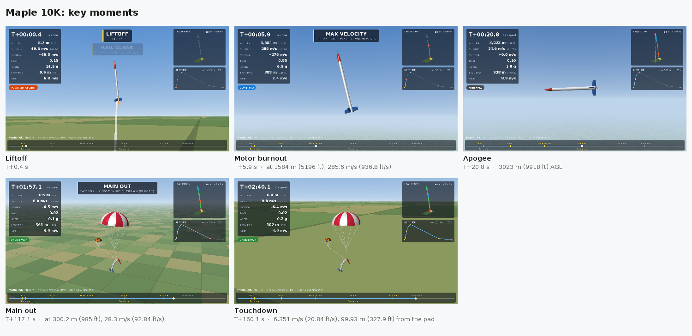

Real time through the burn, slowed down around apogee and each deployment; the coast and the long descent are sped up, with the rate on screen. Events on the timeline:

| Event | Flight time | In the video |
|---|---|---|
| Liftoff | 0.06 s | 1.3 s |
| Rail clear | 0.345 s | 1.6 s |
| Mach 1 | 2.832 s | 4.0 s |
| Max velocity | 4.049 s | 5.3 s |
| Motor burnout | 5.949 s | 7.2 s |
| Apogee | 20.8 s | 10.6 s |
| Drogue out | 20.8 s | 10.6 s |
| Main out | 115.3 s | 14.1 s |
| Touchdown | 161.1 s | 16.3 s |

### 27. "We're also flying a two-stage rocket. Simulate the staging, show it pulled apart and animate it."

<sub>Tools Claude uses: `run_simulation`, `render_3d`, `animate_flight`</sub>

> The sustainer lights at 1.535 s, 62.8 m up at 67.4 m/s and 4.767 deg off vertical (thrust-to-weight 10.27); apogee 674.5 m.
> - Sustainer: lands 33.01 m from the pad at 6.286 m/s.
> - Booster: lands 32.3 m from the pad at 8.493 m/s.

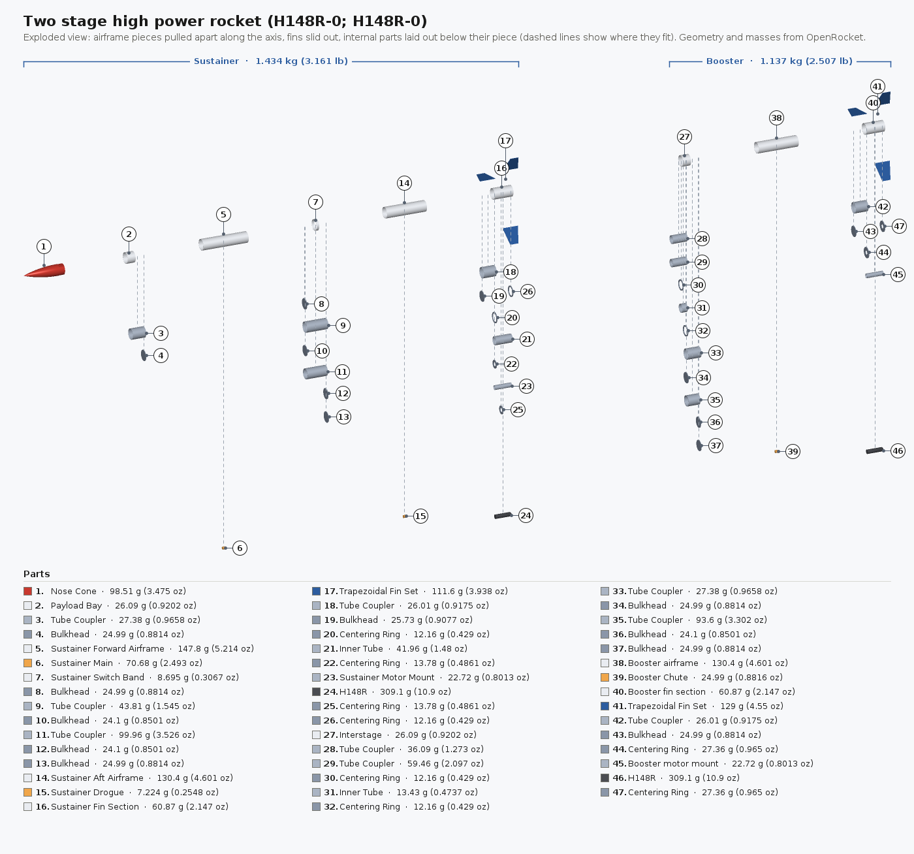

Each stage is followed through the whole flight. The captions name the stage (booster burnout, booster separation, sustainer ignition, sustainer burnout). A booster camera in the lower left follows the dropped booster down under its own chute. The trajectory inset draws its path in orange, and the flight summary lists where each stage lands.

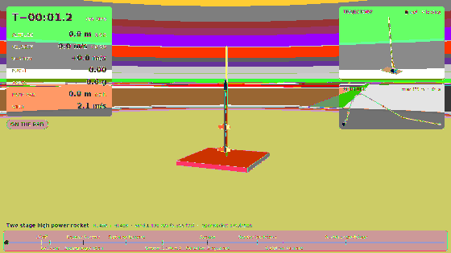

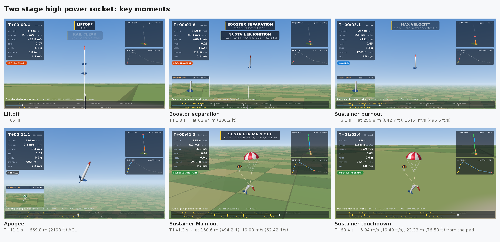

## After the flight

*"Here is our altimeter file — how did we do compared with the prediction?"* Claude lines the log up with the simulation (`compare_flight`), fits the drag so the next prediction is closer, and plots simulated against measured altitude.

## Team history

### 28. "Here's our folder of past rockets and flight logs. Which 4 in rockets have we flown, and how good were our apogee predictions over the years?"

<sub>Tools Claude uses: `design_library`</sub>

> 4 designs (2023-2026), 2 flight logs. 3 of them are 4 in rockets:

| Rocket | File | Year | Motors | Predicted apogee |
|---|---|---|---|---|
| Maple 10K | 2026/maple/maple-10k.ork | 2026 | M1315W (M, 6645 Ns (1494 lbf-s)) | 3026 m (9929 ft) (simulated now ('MCP - [L1250DM-P]')) |
| Maple 10K | 2025/maple-pdr/maple-pdr.ork | 2025 | L1250DM (L, 4400 Ns (989.2 lbf-s)) | 3142 m (10310 ft) (simulated now in OpenRocket's default conditions (no simulation in the file)) |
| Two stage high power rocket | 2024/two-stage.ork | 2024 | H148R, H148R (I, 430.4 Ns (96.75 lbf-s)) | 675 m (2214 ft) (saved result of 'Simulation 1') |

Each altimeter log is matched to its design by name or folder:

| Year | Rocket | Predicted | Measured | Error |
|---|---|---|---|---|
| 2023 | Dual parachute deployment | 897.5 m (2944 ft) | 790 m (2592 ft) | +13.6% |
| 2024 | Two stage high power rocket | 675 m (2214 ft) | 609.9 m (2001 ft) | +10.67% |

> Overall, predictions over-estimated apogee by 12.13% on average over 2 flights (scatter 2.071%). Scale this year's predicted apogee by 0.8918 for a first estimate, and calibrate the drag with compare_flight on the closest past rocket's log.

<sub>(The two flight logs are samples made for this page; point Claude at your own folder of `.ork` / `.rkt` files and altimeter CSVs.)</sub>

Ask for `similarTo` to find the past rocket closest to the one you are designing, then open it to reuse its parts.
